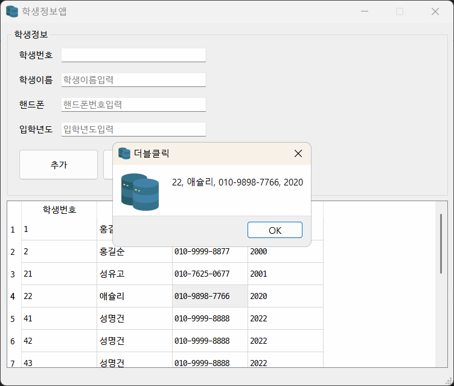

## 토이프로젝트
Python GUI - Oracle연동 프로그램

### GUI 프레임워크
- GUI 프레임워크 종류
    1. tkinter 
        - 파이썬에 내장된 프로그램, 중소형 프로그램사용, 간단하게 사용가능, 안 이쁨
    2. **PyOt** / PySide 
        - C/C++에서 사용하는 GUI프레임워크 OT를 파이썬에 사용하게 만든 라이브러리, 현재 6버전, 유료
        - ptot의 사용라이센스 문제로 pyside 릴리스, PyOt에서 PySide 변경하는데 번거로움이 존재
        - tkinter보다 난이도가 있음
        - 아주 이쁨, OtDesiger툴로 포토샵처럼 GUI 디자인중
        - Python GUI중에서 가장 많이 사용중
    3. Kivy
        - OpenGL(게임엔진용 3D 그래픽엔진)으로 구현되는 GUI 프레임 워크
        - 안드로이드, IOS 등 모바일용로 개발가능
        - 최신에 나온 기술이라 아직 불안정
    4. wxPython
        - kivy처럼 멀티 플랫폼 GUI 프레임 워크
        - 무지 어려움

## PyOt5 GUI 사용
- ptqt 설치
    - 콘솔 > `pip install PyQt5` 설치

- QtDesigner 설치
    - https://build-system.fman.io/qt-designer-download 다운로드 후 설치

     

#### PyQt5 개발
1. PyQt 모듈 사용 원앱만들기
2. 윈도우 기본설정
3. PyQt위젯 사용법(레이블, 버튼...)
4. 시그널(이벤트) 처리방법
5. QtDesigner로 화면 디자인, PyQt와 연동

 


#### Oracle연동 GUI개발 시작
- 오라클 Python연동 DB(스키마) 생성
    ```sql
    CREATE USER madang IDENTIFIED BY madang;

    -- 권한 설정
    GRANT CONNECT, resource TO madang; 

    -- madang으로 사용 스키마 변경

    -- 테이블 Students 생성

    CREATE TABLE Students (
	    std_id 			NUMBER 			PRIMARY KEY,
	    std_name 		varchar2(100) 	NOT NULL,
	    std_mobile 		varchar2(15) 	NULL,
	    std_regyear		number(4, 0) 	NOT null
    );

    -- Students용 시퀀스 생성
    CREATE SEQUENCE SEQ_STUDENT
	    INCREMENT BY 1
	    START WITH 1;

    COMMIT;
    -- 사용자  madang으로 변경
    ```
- Student 테이블 생성, 더미데이터 추가
    ```sql
    SELECT * FROM students;

    -- 더미데이터 삽입

    INSERT INTO STUDENTS
    VALUES (SEQ_STUDENT.nextval, '홍길동', '010-9999-8888', 1987);
    INSERT INTO STUDENTS
    VALUES (SEQ_STUDENT.nextval, '홍길순', '010-9999-8877', 1997);
    ```
- Python 오라클 연동 테스트
    - 오라클 모듈
        - oracleDB   - 오라클 최신버전 매칭
        - Cx_Oracle  - 구버전까지 잘 됨
    - 콘솔에서 pip install cx_Oracle
    - microsoft C++ Build Tools 필요
    - bulie Tool, C++ Cmake
        - Visual Studio Installer 실행
        - 개별 구성요소에서 아래 요소 선택
            - [x] MSVC v1XX - VS 20XX C++ x64/x86 빌드도구
            - [x] C++ CMaker Tools for Window
            - [x] Window 10 SDK(10.0.xxxxx)
        - 설치
    - 콘솔에서 `> pip install cx_Oracle`
    - 콘솔 오라클 연동 : [python](./) 
        - DPI-1047오류발생 -> 64-bit Oracle Cilent Library가 OS에 설치되어 있지 않아서 발생
        - 아래 사이트에서 버전에 맞는 Oracle Cilent를 다운로드
        - https://www.oracle.com/kr/database/technologies/instant-client/winx64-64-downloads.html
        - 11g 다운로드
        - 압축해제(C:\DEV\Tool\instantcilent_11_2), 시스템정보 Path등록
        - 재부팅
    - 콘솔 테스트 결과

        

- QtDesginer로 화면구성

    

## 8일차 

- PyQt로 Oracle 연동 CRUD구현
    - 조회 select 구현
    - 삽입 insert 구현
    - 수정, 삭제 구현
    - 입력값 검증(validation check) 로직
    - DML이 종료된 후 다시 데이터 로드 로직 추가
    - 데이터 삽입 후 라인에디트에 기존 입력값이 남아있는 것 제거

    

- 개발도중 문제
    - [x] DB에 저장된 데이터를 테이블위젯에서 더블클릭 한 뒤 수정않고 추가를 눌러도 새로 데이터가 삽입되는 문제
    - [x] 수정모드에서 추가를 한 뒤 학생번호가 라인에디트에 그대로 존재

- 개발완료 화면
    - 아이콘 변경 및 추가

    

### 데이터베이스 모델링
- 서점 데이터 모델링
    - 현실세계 데이터를 DB내에 옮기기 위해서 DB설계하는 것
    - 모델링 중요점
        1. 객체별로 분리할 것. 객체 -> 테이블
        2. 각 객체별로 어떤 속성을 가지고 있는지 분리. 속성 -> 컬럼
        3. 결정자가 없으면 결정자를 어떻게 만들지 파악. 결정자 -> PK
        4. 어느 객체와 어느 객체가 관련이 있는지 분석. 부모객체와 자식객체의 관련을 정립. 관계, PK/FK
        5. 한 컬럼에 데이터를 한 개의 데이터만 저장되는 지 파악
    
    - 모델링 순서
        1. 객체 분리 - 고객정보, 도서정보, 출판사정보, 주문정보
        2. 속성 분리 - 일반속성, 결정자(PK) 속성
    
    - ERD툴 사용해서 모델링
        - ERDCloud.com(웹), ERWin(앱), Draw.io

- ERDCloud.com
    1. ERD 생성버튼으로 새 ERD 이름작성 후 만들기
    2. 논리 모델링 시작
        - 새 엔티티 추가
        - 엔티티 속성 추가(속성명, 타입, NULL여부)
        - 결정자(PK) 속성 일부 추가
        - 관계(7가지 아이콘) 연결
        - 필요없는 속성제거, 필요한 속성추가
    3. 물리모델링
        - 엔티티의 테이블 입력
        - 각 속성의 컬럼명 입력
        - DB에 맞게 차입과 크기를 변경(Oracle, MySQL)
    
    4. 내보내기
        - DB를 변경
        - PK제약조건, FK제약조건, 비식별제약조건 선택해서
        - SQL 미리보기로 확인
        - SQL 다운로드
    
    5. DBeaver
        - 내보내기한 sql 오픈
        - 스크립트 실행
        - ER다이어그램 그리기
    
 
 ## 10일차
 // 프로그래머스 인증시험 //
 - HR SQL 연습

 - 코딩테스트 진행